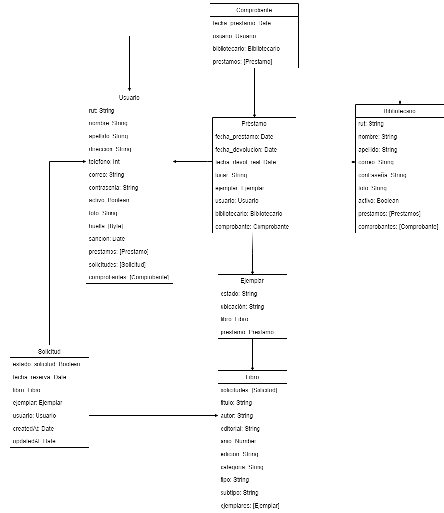

# Caso 16: Sistema de Préstamo en Biblioteca Municipal :books: 
La biblioteca de Estación Central (BEC) cuenta con una amplia colección de libros de todos los géneros literarios, además de una gran colección de documentos técnicos, lo que la transforma en un referente para los alumnos de colegios e instituciones de educación superior de la comuna, incluso prefiriéndola a las bibliotecas de sus correspondientes recintos estudiantiles. Desde hace un tiempo, la biblioteca también ha abierto sus puertas a los vecinos de la comuna.
Este recinto, además, cuenta con una extensa colección de multimedia incluyendo películas y documentales en formato de DVD y Blue Ray, además de variados registros auditivos (música, relatos, colección de sonidos, etc.).
Los bibliotecarios se encuentran capacitados para responder casi en la totalidad a las consultas de los usuarios de la biblioteca, por tener amplio conocimiento de la colección presente en las estanterías.

## Autores (Los ChocoLovers) :chocolate_bar:
* Pedro Mérida
* Javiera Villarroel

## Dependencias extras utilizadas
* graphql-iso-date
* node-schedule

## Pasos previos
1. Instalar dependencias
2. Cambiar credenciales de MongoDB en server.js
3. Correr "npm start"
4. Ir a localhost:8090/graphql

## Instalación utilizando npm/yarn
1. npm install -g nodemon
2. npm install -g yarn
3. yarn add mongoose
4. yarn add express
5. yarn add apollo-server-express
6. yarn add graphql
7. yarn add cors
8. yarn add lodash
9. yarn add body-parser
10. yarn add graphql-iso-date
11. npm install node-schedule

## Duración de los prestamos
* Libros en casa: 15 días
* Libros en sala: 5 horas
* Multimedia en casa: 7 días
* Multimedia en sala: 3 horas

## Sanciones
La sanción del usuario en caso de devolución con atraso corresponde a **el triple de tiempo del que se atrase**.

## Modelo

## Relaciones más importantes
El negocio funciona de la siguiente manera:
  * Un usuario revisa el catálogo de libros de la biblioteca y realiza una solicitud de los libros que desea adquirir, luego un bibliotecario gestiona esta solicitud y busca los libros en las estanterias de la biblioteca para entregarlos, finalmente cuando el usuario se acerca al meson a recoger los libros solicitados, se realiza un prestamo, el cual se utiliza para el seguimiento de los libros prestados y para establecer fechas de devolución.

De la descripción anterior podemos extraer que las relaciones mas importantes son las que contienen a "Solicitud", ya que sin esta, los usuario no podrian pedir libros a la biblioteca, por ende no habria negocio; y "Prestamo", ya que sin este, no se podrian hacer seguimiento de los libros prestados, no se establecerian fechas limite y el negocio seria incapaz de existir por la falta de control.

## Requerimientos funcionales
1. Los usuarios del sistema de préstamo y devolución (bibliotecarios y administrativo de biblioteca), deben autenticarse al ingresar al sistema.
    * Este requerimiento se aborda con la validación del usuario y bibliotecario que ingresa sesión (**ValidacionUsuario** y **ValidacionBibliotecario**) donde se valida que la contraseña ingresada corresponde a la del correo ingresado.
2. Se debe crear la administración de la colección bibliográfica, ingresando información de los documentos como título, autor, tipo (libro, audio, video, etc.), editorial, edición, año de edición, ubicación en estanterías, etc.
    * Este requerimiento se aborda con la creación de libros y ejemplares (**addLibro y addEjemplar**), donde se específica los atributos mencionados. Para más detalle, ver la explicación de aquellos métodos.
3. La consulta de catálogo en los totem’s no necesita autenticación.
    * Este requerimiento no se aborda en esta capa del sistema.
4. La solicitud de préstamo en los totem’s requiere autenticación por parte del usuario.
    * Este requerimiento no se aborda en esta capa del sistema.
5.	El sistema debe permitir registrar la ficha del usuario, en esta ficha se registrarán datos como rut, nombres y apellidos, dirección, teléfono, correo electrónico, huella digital y foto.
    * Este requerimiento se aborda con la creación del usuario (**addUsuario**). Para más detalle, ver la explicación del método.
6.	El usuario debe recibir un correo electrónico para activar la cuenta, si el usuario no realiza la validación a través del correo, la cuenta no se activará.
    * En esta parte del sistema, se aborda parte del requerimiento con la actualización (**updateUsuario**) de si el usuario se encuentra activo o no.
7.	Se debe generar un catálogo electrónico con el cual interactuará el usuario, dicho catálogo debe permitir la búsqueda de documentos por nombre, autor o categoría. Una vez aplicado el filtro se deben mostrar los datos del documento más su disponibilidad, se debe mostrar además cuantos ejemplares se encuentran prestados en sala (el usuario puede elegir esperar que el documento vuelva a estar en estanterías).
    * Este requerimiento se aborda con el método **getCatalogo**, el cual permite realizar la consulta por los campos mencionados para encontrar libros. Para más detalles, ver explicación del método.
8.	Se puede solicitar el préstamo en sala o a domicilio de los libros que se elijan desde el catálogo.
    * Este requerimiento se aborda con la creación de una solicitud (**addSolicitud**), la cual debe ser ingresada especificando si el préstamo es en sala de lectura, sala multimedia o a casa. Para más detalles, ver explicación del método.
9.	Se debe ofrecer la posibilidad de reservar un ejemplar para una fecha específica a través del tótem.
    * Este requerimiento se aborda con la creación de una solicitud (**addSolicitud**), la cual debe ser ingresada con una fecha de reserva, la cual puede ser a futuro o para el mismo día.
10.	El bibliotecario debe tener implementada una pantalla que le permita ver las solicitudes de préstamo, con estos datos puede buscar los documentos en estantería.
    * Este requerimiento se aborda con el metodo **getSolicitudesEstado**, el cual muestra las solicitudes de prestamo que no han sido gestionadas aún. Para más detalles, ver explicación del metodo
11.	Una vez que el usuario se acerca al mesón, debe registrarse el préstamo ingresando los libros prestados al sistema, el rut y la huella digital del usuario como mecanismo de validación. La aplicación debe calcular la fecha y hora de devolución en caso que el préstamo sea a domicilio y solo la hora de devolución en caso que el préstamo sea en sala.
    * Este requerimiento se aborda con la creación del préstamo (**addPrestamo**) donde es necesario ingresar el usuario que va a requerir el préstamo y la fecha del préstamo. Este método calculará automáticamente la fecha y hora de devolución según los criterios presentados más arriba. Para la validación del usuario, se aborda con el método **ValidacionRutUsuario** donde se valida que la huella ingresada corresponde a la registrada con el RUT.
12.	Una vez ingresado el préstamo a domicilio se debe generar un comprobante que indique cada uno de los documentos en préstamo más la fecha/hora de devolución para cada uno de ellos (considerando que no todos los documentos tienen el mismo plazo de préstamo).
    * Este requerimiento se aborda con la creación de un comprobante (**addComprobante**) y la creación de préstamos (**addPrestamo**) donde se considerará que desde el controlador, se creará primero un comprobante sin prestamos asociados, para que cuando se vayan agregando cada préstamo ingresado por interfaz se vaya creando con la referencia del comprobante anteriormente creado, y de igual forma se van agregando los préstamos a Comprobante. Finalmente, para ver la información detallada del préstamo, se tiene el método **getComprobante**
13.	Se debe crear una opción que permita al administrativo de biblioteca revisar los préstamos en sala que están vencidos, esto con la finalidad de solicitar la devolución.
    * Este requerimiento se aborda con el método **getPrestamosVencidos**, ingresando el lugar de dónde se quieren ver los préstamos vencidos, pudiendo ser Sala Multimedia, Sala Lectura o Casa.
14.	Se debe crear una opción que permita al administrativo de biblioteca revisar los préstamos a domicilio que se encuentran en mora y enviar en forma automática un recordatorio de devolución.
    * Este requerimiento se aborda con el método mencionado anteriormente **getPrestamosVencidos**, en este caso, ingresando el lugar de Casa. El recordatorio de devolución no se aborda en esta capa del sistema, sin embargo, con este método se obtiene la información de los usuarios con préstamos vencidos para enviar los recordatorios.
15.	Se debe generar la devolución de documentos, al ingresar el código del ejemplar éste debe quedar marcado como devuelto y media hora después debe quedar marcado como disponible (para dar tiempo a los bibliotecarios de devolverlo a las estanterías).
    * Este requerimiento se aborda con el método **updatePrestamo** que corresponde a realizar una devolución ingresando la fecha de devolución. Al devolver el préstamo, se actualiza el estado del ejemplar como Devuelto y mediante el uso de NodeSchedule luego de 30 minutos se actualiza a Disponible.
16.	En caso de devolución con atraso, el sistema debe calcular una sanción (en tiempo) al usuario, es decir, no podrá solicitar préstamos hasta que se cumpla el tiempo sancionado.
    * Este requerimiento se aborda con el método **updatePrestamo** que corresponde a realizar una devolución ingresando la fecha de devolución. Al devolver el préstamo, se compara con la fecha de devolución pronosticada, en caso de que la fecha de devolución real sea mayor, se calcula la sanción correspondiente, actualizando el atributo sanción del Usuario.

## Proceso de test
1. Acceder a localhost:8090/graphql e ir a Apollo Server
2. Agregar un libro, utilizando la siguiente Mutation en Apollo Server:
~~~
mutation Mutation($input: LibroInput) { 
  addLibro(input: $input) {
    id
    titulo
    autor
    editorial
    anio
    edicion
    categoria
    tipo
    subtipo
  }
}
~~~
En este caso, se especificó el siguiente input:
~~~
{
  "input": {
    "titulo": "PRINCIPITO, EL",
    "autor": "DE SAINT-EXUPERY, ANTOINE",
    "editorial": "SALAMANDRA",
    "anio": 1943,
    "edicion": "Edición 2016",
    "categoria": "Literatura",
    "tipo": "Libro",
    "subtipo": "Clásicos Universales"
  }
}
~~~
Retornando lo siguiente:
~~~
{
  "data": {
    "addLibro": {
      "id": "633670ca2436056ff7585875",
      "titulo": "PRINCIPITO, EL",
      "autor": "DE SAINT-EXUPERY, ANTOINE",
      "editorial": "SALAMANDRA",
      "anio": 1943,
      "edicion": "Edición 2016",
      "categoria": "Literatura",
      "tipo": "Libro",
      "subtipo": "Clásicos Universales"
    }
  }
}
~~~
3. Agregar un ejemplar para ese libro con AddEjemplar
~~~
mutation AddEjemplar($input: EjemplarInput) {
  addEjemplar(input: $input) {
    id
    estado
    ubicacion
  }
}

{
  "input": {
    "ubicacion": "Estanteria L1, Piso 1",
    "libro": "633670ca2436056ff7585875"
  }
}
~~~
Retornando lo siguiente:
~~~
{
  "data": {
    "addEjemplar": {
      "id": "633671542436056ff7585878",
      "estado": "Disponible",
      "ubicacion": "Estanteria L1, Piso 1"
    }
  }
}
~~~
4. Repetir el proceso para tener dos ejemplares del mismo libro
~~~
{
  "data": {
    "addEjemplar": {
      "id": "6336717c2436056ff758587c",
      "estado": "Disponible",
      "ubicacion": "Estanteria L1, Piso 1"
    }
  }
}
~~~
5.  Crear un usuario con AddUsuario
~~~
mutation Mutation($input: UsuarioInput) {
  addUsuario(input: $input) {
    id
    rut
    nombre
    apellido
    direccion
    telefono
    correo
    contrasenia
    activo
    foto
    huella
    sancion
  }
}

{
  "input": {
    "rut": "1234567-8",
    "nombre": "ERNESTO EDUARDO",
    "apellido": "VIVANCO TAPIA",
    "direccion": "Vicuña Mackenna 3939, San Joaquín, Región Metropolitana",
    "telefono": 912345678,
    "correo": "eduardo.vivanco@gmail.com",
    "contrasenia": "wwwusm"
  }
}
~~~
Retorna:
~~~
{
  "data": {
    "addUsuario": {
      "id": "633673f368595df23484392b",
      "rut": "1234567-8",
      "nombre": "ERNESTO EDUARDO",
      "apellido": "VIVANCO TAPIA",
      "direccion": "Vicuña Mackenna 3939, San Joaquín, Región Metropolitana",
      "telefono": 912345678,
      "correo": "eduardo.vivanco@gmail.com",
      "contrasenia": "wwwusm",
      "activo": false,
      "foto": null,
      "huella": [],
      "sancion": null
    }
  }
}
~~~
6.  Crear un bibliotecario con AddBibliotecario
~~~
mutation AddBibliotecario($input: BibliotecarioInput) {
  addBibliotecario(input: $input) {
    id
    rut
    nombre
    apellido
    correo
    contrasenia
    foto
    activo
  }
}

{
  "input": {
    "rut": "19867550-4",
    "nombre": "PEDRO DANTE",
    "apellido": "MÉRIDA ÁLVAREZ",
    "correo": "pedro.merida@sansano.usm.cl",
    "contrasenia": "wwwsansano",
  }
}
~~~
Retorna
~~~
{
  "data": {
    "addBibliotecario": {
      "id": "63367488f20836aa80651a21",
      "rut": "19867550-4",
      "nombre": "PEDRO DANTE",
      "apellido": "MÉRIDA ÁLVAREZ",
      "correo": "pedro.merida@sansano.usm.cl",
      "contrasenia": "wwwsansano",
      "foto": null,
      "activo": true
    }
  }
}
~~~
7.  Activar cuenta de usuario con UpdateUsuario, cambiando el campo de "activo" a true
~~~
mutation UpdateUsuario($updateUsuarioId: ID!, $input: UsuarioActualizar) {
  updateUsuario(id: $updateUsuarioId, input: $input) {
    id
    rut
    nombre
    activo
  }
}

{
  "updateUsuarioId": "633673f368595df23484392b",
  "input": {
    "activo": true
  }
}
~~~
Retorna
~~~
{
  "data": {
    "updateUsuario": {
      "id": "633673f368595df23484392b",
      "rut": "1234567-8",
      "nombre": "ERNESTO EDUARDO",
      "activo": true
    }
  }
}
~~~
8.  Realizar búsqueda del catálogo por "principito" y autor "saint", con getLibrosCatalogo
~~~
query Query($titulo: String, $autor: String) {
  getLibrosCatalogo(titulo: $titulo, autor: $autor) {
    id_libro
    titulo
    autor
    editorial
    edicion
    anio
    categoria
    tipo
    subtipo
    ejemplares_disponibles
    ejemplares_sala
  }
}

{
  "titulo": "principito",
  "autor": "saint"
}
~~~

La consulta retorna

~~~
{
  "data": {
    "getLibrosCatalogo": [
      {
        "id_libro": "633670ca2436056ff7585875",
        "titulo": "PRINCIPITO, EL",
        "autor": "DE SAINT-EXUPERY, ANTOINE",
        "editorial": "SALAMANDRA",
        "edicion": "Edición 2016",
        "anio": 1943,
        "categoria": "Literatura",
        "tipo": "Libro",
        "subtipo": "Clásicos Universales",
        "ejemplares_disponibles": 2,
        "ejemplares_sala": 0
      }
    ]
  }
}
~~~
1.  Realizar solicitud de un libro con la mutation addSolicitud, donde fecha_reserva debe ser una ISO Date.
~~~
mutation Mutation($input: SolicitudInput) {
  addSolicitud(input: $input) {
    id
    fecha_reserva
    createdAt
    estado_solicitud
  }
}

{
  "input": {
    "id_libro": "633670ca2436056ff7585875",
    "id_usuario": "633673f368595df23484392b",
    "fecha_reserva": "2022-09-30T02:00:00Z"
  }
}
~~~
Retorna
~~~
{
  "data": {
    "addSolicitud": {
      "id": "6336786a96ae5b3c0a5ab957",
      "fecha_reserva": "2022-09-30T02:00:00.000Z",
      "createdAt": "2022-09-30T05:02:34.354Z",
      "estado_solicitud": false
    }
  }
}
~~~
10. Revisar las solicitudes aún no gestionadas con getSolicitudEstado, un input false en "estadoSolicitud" mostrara dichas solicitudes.
~~~
query Query($estadoSolicitud: Boolean) {
  getSolicitudEstado(estado_solicitud: $estadoSolicitud) {
    id
    fecha_reserva
    createdAt
    updatedAt
    estado_solicitud
    libro {
      id
      titulo
    }
  }
}

{
  "estadoSolicitud": false
}
~~~
Retorna
~~~
{
  "data": {
    "getSolicitudEstado": [
      {
        "id": "6336786a96ae5b3c0a5ab957",
        "fecha_reserva": "2022-09-30T02:00:00.000Z",
        "createdAt": "2022-09-30T05:02:34.354Z",
        "updatedAt": "2022-09-30T05:02:34.354Z",
        "estado_solicitud": false,
        "libro": {
          "id": "633670ca2436056ff7585875",
          "titulo": "PRINCIPITO, EL"
        }
      }
    ]
  }
}
~~~
11. Actualizar la solicitud como gestionada, asignandole un ejemplar con updateSolicitud
~~~
mutation Mutation($updateSolicitudId: ID!, $input: SolicitudActualizar) {
  updateSolicitud(id: $updateSolicitudId, input: $input) {
    id
    fecha_reserva
    createdAt
    updatedAt
    estado_solicitud
  }
}

{
  "updateSolicitudId": "6336786a96ae5b3c0a5ab957",
  "input": {
    "estado_solicitud": true,
    "ejemplar": "633671542436056ff7585878"
  }
}
~~~
Retorna la solicitud actualiza
~~~
{
  "data": {
    "updateSolicitud": {
      "id": "6336786a96ae5b3c0a5ab957",
      "fecha_reserva": "2022-09-30T02:00:00.000Z",
      "createdAt": "2022-09-30T05:02:34.354Z",
      "updatedAt": "2022-09-30T05:09:02.610Z",
      "estado_solicitud": true
    }
  }
}
~~~
12. Revisar estado del ejemplar solicitud con getEjemplar
~~~
query Query($getEjemplarId: ID!) {
  getEjemplar(id: $getEjemplarId) {
    id
    estado
    ubicacion
  }
}

{
  "getEjemplarId": "633671542436056ff7585878"
}
~~~
Retorna el ejemplar
~~~
{
  "data": {
    "getEjemplar": {
      "id": "633671542436056ff7585878",
      "estado": "Reservado",
      "ubicacion": "Estanteria L1, Piso 1"
    }
  }
}
~~~
Notando que su estado es "Reservado"

13. El usuario se acerca al mesón para solicitar el ejemplar a domicilio, el bibliotecario crea el préstamo mediante la mutation addPrestamo. Se crea un comprobante vacío para ir agregando los préstamos con la mutation addComprobante.
~~~
mutation AddComprobante($input: ComprobanteInput) {
  addComprobante(input: $input) {
    id
    fecha_prestamo
  }
}

{
  "input": {
    "fecha_prestamo": "2022-09-30T05:18:00Z",
    "usuario": "633673f368595df23484392b",
    "bibliotecario": "63367488f20836aa80651a21"
  }
}
~~~
Retorna el comprobante
~~~
{
  "data": {
    "addComprobante": {
      "id": "63367bd6b540cb5c4042614c",
      "fecha_prestamo": "2022-09-30T05:18:00.000Z"
    }
  }
}
~~~

Luego, se crea el préstamo con addPrestamo
~~~
mutation Mutation($input: PrestamoInput) {
  addPrestamo(input: $input) {
    id
    fecha_prestamo
    fecha_devolucion
    fecha_devol_real
    lugar
  }
}

{
  "input": {
    "fecha_prestamo": "2022-09-30T05:18:00Z",
    "lugar": "Casa",
    "ejemplar": "633671542436056ff7585878",
    "usuario": "633673f368595df23484392b",
    "bibliotecario": "63367488f20836aa80651a21",
    "comprobante": "63367bd6b540cb5c4042614c"
  }
}
~~~
Retorna el préstamo creado
~~~
{
  "data": {
    "addPrestamo": {
      "id": "63367cc98a88db85a87d20d1",
      "fecha_prestamo": "2022-09-30T05:18:00.000Z",
      "fecha_devolucion": "2022-10-15T05:18:00.000Z",
      "fecha_devol_real": null,
      "lugar": "Casa"
    }
  }
}
~~~
14. Revisar el comprobante del préstamo con getComprobante
~~~
query Query($getComprobanteId: ID!) {
  getComprobante(id: $getComprobanteId) {
    id
    fecha_prestamo
    usuario {
      rut
      nombre
      apellido
    }
    bibliotecario {
      rut
      nombre
      apellido
    }
    prestamos {
      id
      fecha_devolucion
      ejemplar {
        id
        libro {
          titulo
          autor
        }
      }
    }
  }
}

{
  "getComprobanteId": "63367bd6b540cb5c4042614c"
}
~~~
Retorna
~~~
{
  "data": {
    "getComprobante": {
      "id": "63367bd6b540cb5c4042614c",
      "fecha_prestamo": "2022-09-30T05:18:00.000Z",
      "usuario": {
        "rut": "1234567-8",
        "nombre": "ERNESTO EDUARDO",
        "apellido": "VIVANCO TAPIA"
      },
      "bibliotecario": {
        "rut": "19867550-4",
        "nombre": "PEDRO DANTE",
        "apellido": "MÉRIDA ÁLVAREZ"
      },
      "prestamos": [
        {
          "id": "63367cc98a88db85a87d20d1",
          "fecha_devolucion": "2022-10-15T05:18:00.000Z",
          "ejemplar": {
            "id": "633671542436056ff7585878",
            "libro": {
              "titulo": "PRINCIPITO, EL",
              "autor": "DE SAINT-EXUPERY, ANTOINE"
            }
          }
        }
      ]
    }
  }
}
~~~
15. Cambiar la fecha del dispositivo a 16 de octubre, fecha en donde el préstamo creado estará vencido. Luego, buscar los préstamos vencidos en Casa mediante la query getPrestamosVencidos
~~~
query GetPrestamosVencidos($lugar: String) {
  getPrestamosVencidos(lugar: $lugar) {
    id_prestamo
    fecha_devolucion
    lugar
    duration
    unit
  }
}

{
  "lugar": "Casa"
}
~~~
Retorna
~~~
{
  "data": {
    "getPrestamosVencidos": [
      {
        "id_prestamo": "63367cc98a88db85a87d20d1",
        "fecha_devolucion": "2022-10-15T05:18:00.000Z",
        "lugar": "Casa",
        "duration": 1,
        "unit": "dias"
      }
    ]
  }
}
~~~
16.  Generar la devolución del préstamo con el método updatePrestamo, indicando el id del prestamo a actualizar. La fecha de devolución real al hacer la mutation, por lo que nuevamente debemos tener como fecha 16 de octubre.
~~~
mutation UpdatePrestamo($updatePrestamoId: ID!) {
  updatePrestamo(id: $updatePrestamoId) {
    id
    fecha_prestamo
    fecha_devolucion
    fecha_devol_real
    lugar
  }
}

{
  "updatePrestamoId": "63367cc98a88db85a87d20d1"
}
~~~
Retornando el prestamo actualizando
~~~
{
  "data": {
    "updatePrestamo": {
      "id": "63367cc98a88db85a87d20d1",
      "fecha_prestamo": "2022-09-30T05:18:00.000Z",
      "fecha_devolucion": "2022-10-15T05:18:00.000Z",
      "fecha_devol_real": "2022-10-16T05:03:25.857Z",
      "lugar": "Casa"
    }
  }
}
~~~
17. Debido a que se devolvió un préstamo vencido, podemos ver la sanción del usuario con el método getUsuario
~~~
query Query($getUsuarioId: ID!) {
  getUsuario(id: $getUsuarioId) {
    id
    nombre
    apellido
    sancion
  }
}

{
  "getUsuarioId": "633673f368595df23484392b"
}
~~~
Retornando
~~~
{
  "data": {
    "getUsuario": {
      "id": "633673f368595df23484392b",
      "nombre": "ERNESTO EDUARDO",
      "apellido": "VIVANCO TAPIA",
      "sancion": "2022-10-19T04:19:43.428Z"
    }
  }
}
~~~
Notando que el usuario tiene una sanción de 3 días
18. Luego, se verifica el estado del ejemplar con getEjemplar, el cual debe ser "Devuelto" antes de que pasen 30 minutos desde que se realizó la devolución
~~~
query GetEjemplar($getEjemplarId: ID!) {
  getEjemplar(id: $getEjemplarId) {
    ubicacion
    id
    estado
  }
}

{
  "getEjemplarId": "633671542436056ff7585878"
}
~~~
Retornando
~~~
{
  "data": {
    "getEjemplar": {
      "ubicacion": "Estanteria L1, Piso 1",
      "id": "633671542436056ff7585878",
      "estado": "Devuelto"
    }
  }
}
~~~
19. Luego, se espera 30 minutos para verificar nuevamente el estado del ejemplar con getLibro. En esta ocasión, se testea el método getLibro para ver los ejemplares del libro El Principito y su estado.
~~~
query Query($getLibroId: ID!) {
  getLibro(id: $getLibroId) {
    id
    ejemplares {
      ubicacion
      id
      estado
    }
  }
}

{
  "getLibroId": "633670ca2436056ff7585875"
}
~~~
Retornando
~~~
{
  "data": {
    "getLibro": {
      "id": "633670ca2436056ff7585875",
      "ejemplares": [
        {
          "ubicacion": "Estanteria L1, Piso 1",
          "id": "633671542436056ff7585878",
          "estado": "Disponible"
        },
        {
          "ubicacion": "Estanteria L1, Piso 1",
          "id": "6336717c2436056ff758587c",
          "estado": "Disponible"
        }
      ]
    }
  }
}
~~~
Notando que los dos ejemplares ahora están disponibles.
## Libros

### Modelo
* id: ID!
* titulo: String!
* autor: String!
* editorial: String!
* anio: Int
* edicion: String
* categoria: String (Biologia, Literatura, Física, etc.)
* tipo: String! (Libro o Multimedia)
* subtipo: String! (Literatura Juvenil, Literatura Española, etc, y en caso de multimedia, DVD, Blu-ray, etc.)
* ejemplares: [Ejemplar]
* solicitudes: [Solicitud]

### Query getLibros
Se muestran todos los libros de la biblioteca junto con su información

### Query getLibro
Se busca un libro por su ID y se muetra la información de dicho libro

### Query getLibrosCatalogo
Se busca un libro filtrando segun los siguiente parametros, cada uno es opcional y aceptan información incompleta (nombre incompleto de titulo, autor, etc):
* título: String
* autor: String
* categoria: String
Este retorna parte de la información del libro y además retorna cuantos ejemplares hay disponibles y cuantos hay en sala.

### Mutation addLibro
Se agrega un libro con los siguientes parámetros:
* titulo: String!
* autor: String!
* editorial: String!
* anio: Int
* edicion: String
* categoria: String
* tipo: String!
* subtipo: String!

### Mutation updateLibro
Se busca un libro por su ID y se actualiza su información. Se puede actualizar los siguientes parámetros:
* titulo: String
* autor: String
* editorial: String
* anio: Int
* edicion: String
* categoria: String
* tipo: String
* subtipo: String

### Mutation deleteLibro
Se busca un libro por su ID y se elimina.

## Ejemplares

### Modelo
* id: ID!
* estado: String! (Reservado, Sala Lectura, Sala Multimedia, Casa, Devuelto, Disponible)
* ubicacion: String (Estanteria en la que se encuentra por ejemplo A3)
* libro: Libro!
* prestamo: Prestamo

### Mutation addEjemplar
Agrega un ejemplar con los siguientes parámetros, donde por defecto su estado sera Disponible:
* ubicacion: String $\rightarrow$ Ubicación dentro de la biblioteca, por ejemplo, estanteria A1.
* libro: String! $\rightarrow$ ID del libro al cual corresponde el ejemplar.

### Mutation updateEjemplar
Se actualiza un ejemplar con el siguiente parámetro opcional
* ubicacion: String
Se hace la observación de que el estado de un ejemplar se actualiza solo cuando se crea o se libera un prestamo.

### Mutation deleteEjemplar
Elimina un ejemplar por su ID. Se elimina la referencia de este ejemplar dentro de Libro.

### Query getEjemplar
Se obtiene un ejemplar por su ID.

### Query getEjemplares
Se obtienen todos los ejemplares.

## Solicitudes

### Modelo
* id: ID!
* fecha_reserva: Date
* createdAt: Date
* updatedAt: Date
* estado_solicitud: Boolean (0 si no ha sido gestionada y 1 en caso contrario)
* libro: Libro!
* ejemplar: Ejemplar!
* usuario: Usuario!

### Query getSolicitudes
Se muestran todas las solicitudes de libros hechas junto con su información.

### Query getSolicitud
Se busca una solicitud por su ID y se muetra la información de esta.

### Query getSolicitudEstado
Se buscan solicitudes de acuerdo a su campo de "Estado solicitud" y se muestran en pantalla, esto para saber que solicitudes estan pendientes por gestionar y cuales no (False si es que aun hay que gestionarla y True si es que no)

### Mutation addSolicitud
Se agrega una solicitud solicitando los siguientes parámetros:
* ID del usuario solicitador
* id_libro: String! $\rightarrow$ ID del libro solicitado
* id_usuario: String! $\rightarrow$ ID del usuario que solicita
* fecha_reserva: Date! $\rightarrow$ Fecha para la cual quiere reservar el libro

Las fechas de creación y actualización son generadas automaticamente y el estado, cuando es creada la solicitud, es por defecto False.

### Mutation updateSolicitud
Se busca una solicitud por su ID y se pueden actualizar los siguientes parámetros:
* estado_solicitud: Boolean
* ejemplar: String
La fecha de actualización se actualiza automaticamente.

### Mutation deleteSolicitud
Se busca una solicitud por su ID y se elimina, ademas dicha solicitud también se elimina de la lista de solicitudes del usuario y del libro.

## Prestamos

### Modelo
* id: ID!
* fecha_prestamo: Date
* fecha_devolucion: Date
* fecha_devol_real: Date
* lugar: String (Sala de lectura, Sala multimedia o Casa)
* ejemplar: Ejemplar!
* usuario: Usuario!
* bibliotecario: Bibliotecario!

### Mutation addPrestamo
Se agrega un préstamo con los siguientes parámetros obligatorios:
* fecha_prestamo: Date
* Fecha de devolución (Generada automáticamente)
* lugar: String! $\rightarrow$ Lugar a donde se lleva el préstamo (Sala de lectura, Sala multimedia o Casa)
* ejemplar: String! $\rightarrow$ ID del ejemplar prestado
* usuario: String! $\rightarrow$ ID del usuario al que se le realiza el préstamo
* bibliotecario: String! $\rightarrow$ ID del bibliotecario que gestiona el préstamo
Al agregar un préstamo, se agrega la referencia del préstamo a Usuario y Bibliotecario (como listas de Préstamos), además, se agrega la referencia a Ejemplar y se actualiza el estado del ejemplar con el valor del lugar donde se lleve el préstamo.
  
### Mutation updatePrestamo
Actualiza el préstamo con el parámetro:
* fecha_devol_real: Date $\rightarrow$ Fecha de devolución real.
Por lo tanto, solo se actualiza el prestamo cuando **este es devuelto**.
Consideraciones:
* Al actualizar, se libera el ejemplar eliminando la referencia de Préstamo dentro de Ejemplar
* El estado del ejemplar se actualiza a *Devuelto*. Luego de 30 minutos de entregar el prestamo, se actualiza el ejemplar a **Disponible**, haciendo uso de node-schedule.

### Mutation deletePrestamo
Se elimina el préstamo según ID. Se elimina la referencia de Préstamo en Ejemplar, Usuario y Bibliotecario.

### Query getPrestamos
Se obtiene todos los préstamos

### Query getPrestamo
Se obtiene el préstamo según su ID

### Query getPrestamosVencidos
Se ingresa un lugar: String para obtener los préstamos vencidos, ya sea en Sala Lectura, Sala Multimedia, Casa, etc, y se retorna los préstamos vencidos en ese momento (fecha actual) en el lugar ingresado. Se retorna los siguientes datos del préstamo:
* id_prestamo: ID
* fecha_devolucion: Date
* lugar: String
* duration: Int
* unit: String
La unidad será en días si el lugar es en Casa, y en horas si el lugar es en Sala.

### Query getPrestamosByUsuario
Se ingresa el id del usuario para entregar todos los préstamos que ha pedido.

### Query getPrestamosByBibliotecario
Se ingresa el id del bibliotecario para entregar todos los préstamos que han sido creados por el bibliotecario.

## Comprobante

### Modelo
* id: ID!
* fecha_prestamo: Date!
* usuario: Usuario!
* bibliotecario: Bibliotecario!
* prestamos: [Prestamo]
### Mutation addComprobante
Para la creación de comprobantes, se consideró lo siguiente:
* En la interfaz para el bibliotecario se permitirá agregar varios ejemplares a un préstamo
* De esta forma, cuando el bibliotecario complete el formulario, el controlador generará una misma fecha de préstamo para todos los ejemplares ingresados, fecha que se enviará al backend para cada ejemplar.
* Además, antes de crear los préstamos, se creará un comprobante vacío. Al tener el id del comprobante creado, se utilizará como input al crear un préstamo, de esta forma el préstamo se agregará al comprobante corrrespondiente.

Luego, para crear un comprobante, se solicita lo siguiente:
* fecha_prestamo: Date!
* usuario: String!
* bibliotecario: String!

### Mutation deleteComprobante
En caso de que se necesite eliminar un comprobante, por ejemplo, debido a una transacción incorrecta de creación de préstamos, se puede eliminar un comprobante, para ello solo recibe el id del comprobante y se elimina tanto el comprobante como la referencia en sus préstamos asociados.

### Query getComprobante
Se ingresa el id del comprobante para mostrar toda su información importante. Esto significa que se hace un populate de todos sus campos, además de populate de ejemplar dentro de préstamos y de libro dentro de ejemplar.

### Query getComprobantesByUsuario
Se ingresa el id del usuario para entregar todos los comprobantes de préstamo entregados al usuario.

### Query getComprobantesByBibliotecario
Se ingresa el id del bibliotecario para entregar todos los comprobantes de préstamo que han sido creados por el bibliotecario.

## Usuarios

### Modelo
* id: ID!
* rut: String!
* nombre: String!
* apellido: String!
* direccion: String!
* telefono: Int!
* correo: String!
* contrasenia: String
* activo: Boolean! (0 si es que la cuenta del usuario no esta activa, 1 en caso contrario)
* foto: String (Direccion en la que se encuentra la foto)
* huella: [Boolean]
* sancion: Date (null si es que el usuario no tiene una sanción por atraso, una fecha en caso contrario)
* prestamos: [Prestamo]
* solicitudes: [Solicitud]

### Query addUsuario
Se agrega un usuario con los siguientes parámetros, donde por defecto no se encuentra activo. Todos los campos son obligatorios a excepción de la ruta de foto de perfil y huella digital.
* rut: String!
* nombre: String!
* apellido: String!
* direccion: String!
* telefono: Int!
* correo: String!
* contrasenia: String!
* foto: String $\rightarrow$ Este campo contiene la ruta donde se encuentra la foto de perfil
* huella: [Boolean]

### Mutation updateUsuario
Actualiza un usuario según los siguientes parámetros opcionales:
* rut: String
* nombre: String
* apellido: String
* direccion: String
* telefono: Int
* correo: String
* contrasenia: String
* activo: Boolean
* foto: String
* huella: [Boolean]

### Mutation deleteUsuario
Elimina un usuario según su ID. Elimina la referencia del Usuario en Préstamo y Solicitud. 
**No se aconseja su uso, solo en casos extremos. Para dar de baja un usuario, lo ideal es actualizar su estado de activo.** Esto con la finalidad de no perder la referencia del usuario en caso de que tenga préstamos asociados.

### Query getUsuario
Obtiene un usuario según su ID.

### Query getUsuarios
Obtiene todos los usuarios del sistema.

## Bibliotecario

### Modelo
* id: ID!
* rut: String!
* nombre: String!
* apellido: String!
* correo: String!
* contrasenia: String
* foto: String
* activo: Boolean! (0 si es que el bibliotecario no esta activo o fue dado de baja, 1 en caso contrario)
* prestamos: [Prestamo]

### Mutation addBibliotecario
Agrega un bibliotecario al sistema con los siguientes parámetros, donde por defecto el bibliotecario se encuentra activo:
* rut: String!
* nombre: String!
* apellido: String!
* correo: String!
* contrasenia: String
* foto: String

### Mutation updateBibliotecario
Actualiza un bibliotecario según los siguientes parámetros opcionales:
* rut: String
* nombre: String
* apellido: String
* correo: String
* contrasenia: String
* foto: String
* activo: Boolean

### Mutation deleteBibliotecario
Elimina un bibliotecario por su ID. En caso de tener préstamos asociados, se elimina la referencia de Bibliotecario en Préstamo. 
**No se aconseja su uso, solo en casos extremos. Para dar de baja un bibliotecario, lo ideal es actualizar su estado de activo.** Esto con la finalidad de no perder la referencia del bibliotecario en caso de que tenga préstamos asociados.
